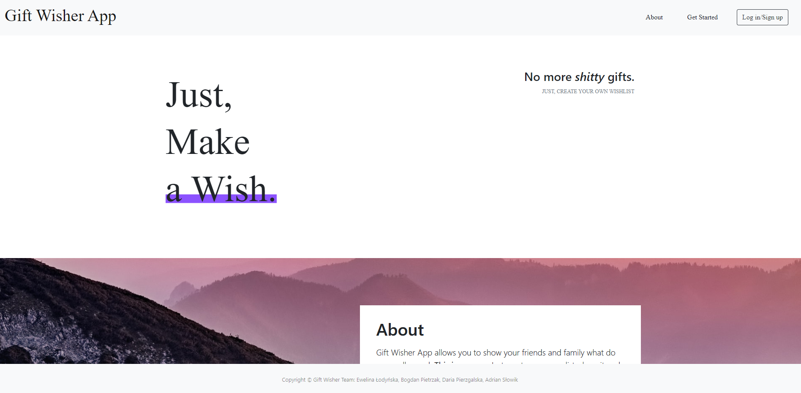

# Spring Boot Heroku Demo App

Simple example project showing how to connect:
 * [Spring Boot App](https://spring.io/projects/spring-boot)
 * [Heroku Hosting](https://heroku.com)
 * [Postgres Heroku Database](https://data.heroku.com)
 * [Thymeleaf + Thymeleaf Templates](https://www.thymeleaf.org/)

# Demo
Application is available here 